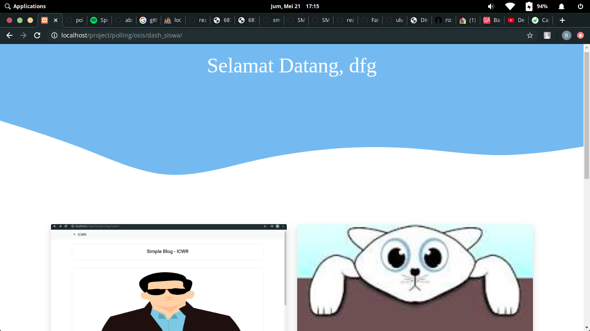
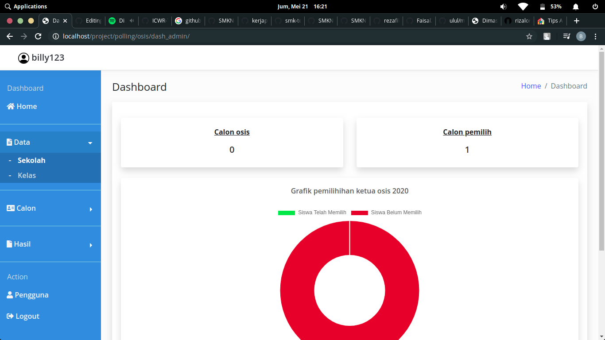
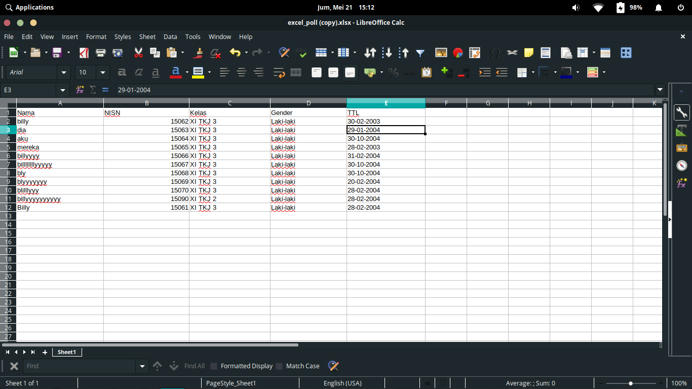

<h1 align="center">Polling Osis</h1>


<br><br>


# Dibuat dari
```
1. CodeIgniter
2. Bootstrap
```

# Template


<a href="https://github.com/rezafikkri/Reza-Admin">RezaAdmin</a>

# Lisensi


# Fitur

```
1. Tambah siswa
2. Tambah calon osis
3. Coblos osis
4. Tambah user, dll
```

# Halaman admin

```
[path]/admin

Username default = billy123
Password default = billy 123
```

# Cara Konfigurasi

```
1. Buat database dulu dengan nama polling_osis.sql (tutor cek google aja).
2. Import file yang bernama polling_osis.sql ke phpmyadmin anda.
3. Setting username,password,host,namadb anda di file application > config > database.php sesuai konfigurasi anda.
4. Selanjutnya masuk ke halaman admin.
Website siap digunakan!
```

# Format Penambahan Calon Pemilih Massal



# Demo

<a href="https://www.youtube.com/watch?v=CMwsL03WuAw"></a>

# Terimakasih kepada

[ <a href="https://github.com/rezafikkri/">Reza Sariful Fikri</a> ] dan [ <a href="https://github.com/ICWR-TEAM/">ICWR-TEAM</a> ]
